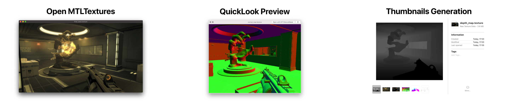

# MTLTextureViewer

[`Apple Metal Texture`](https://developer.apple.com/documentation/metal/mtltexture) Viewer for MacOS.

⚠️ Currently this project is in early alfa stage and it's a subject for improvements.

    

## Key Features

  * open image / texture filess
  * export files as texture / image

## Supported Formats

  * `.texture` (raw [`MTLTexture`](https://developer.apple.com/documentation/metal/mtltexture) data)
  * `.compressedTexture` ([`MTLTexture`](https://developer.apple.com/documentation/metal/mtltexture) data compressed with [`LZFSE`](https://en.wikipedia.org/wiki/LZFSE))
  * `.png`
  * `.jpg`
  * `.heic`

# [License](LICENSE)

MIT
